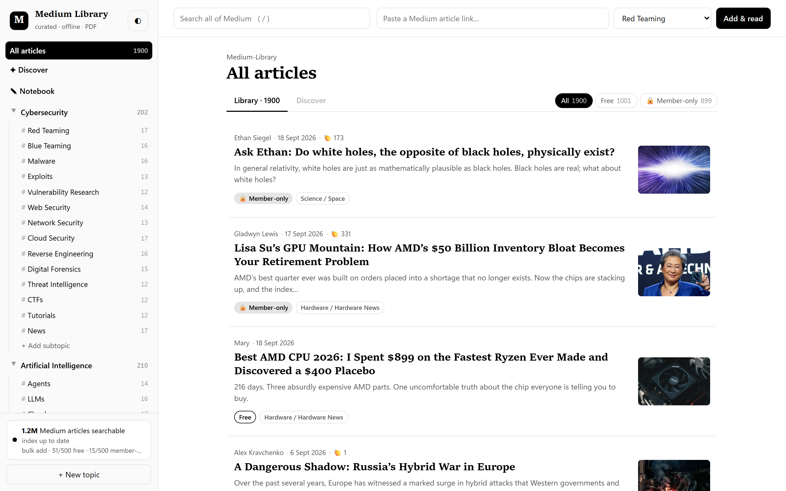
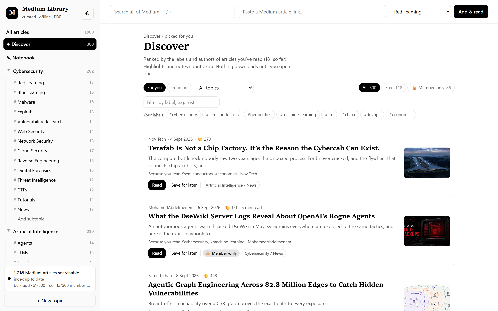
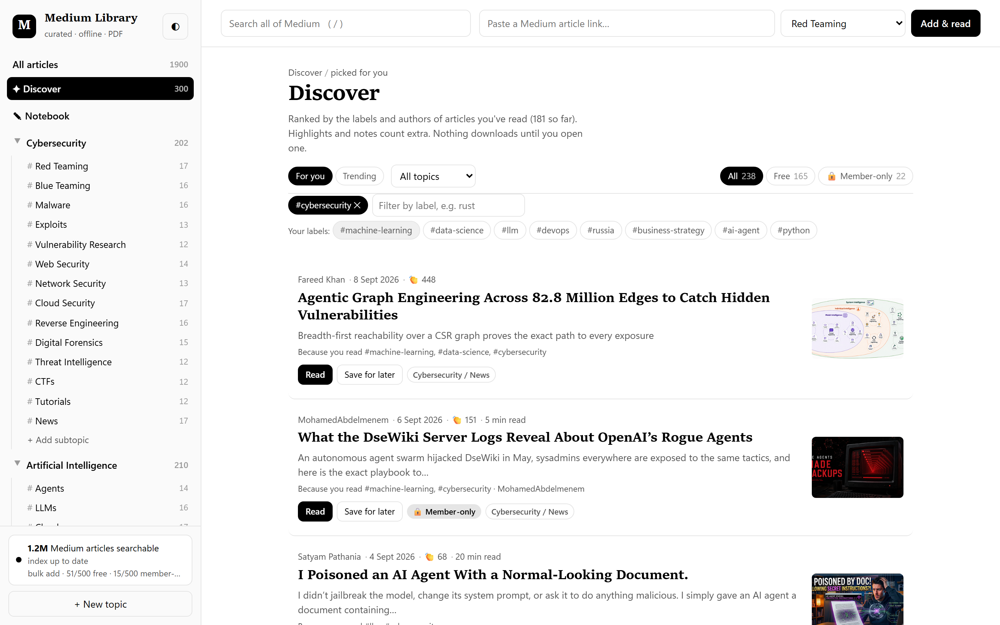
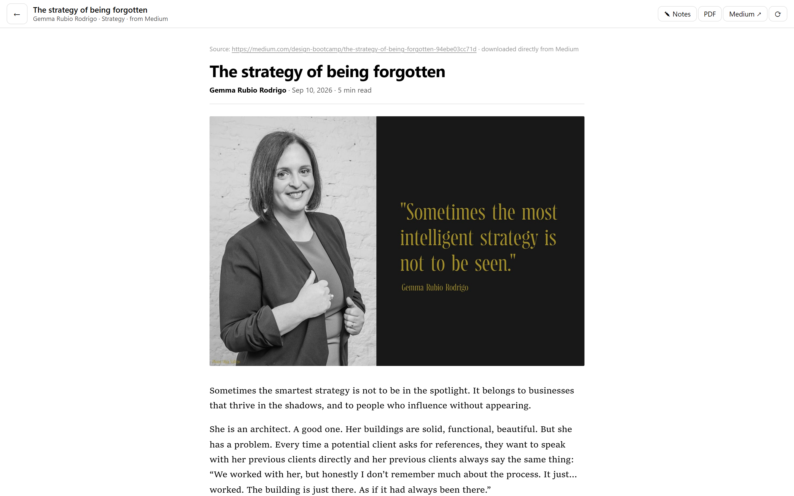

<h1 align="center">Medium Library</h1>

<p align="center">
  A local, curated library of Medium articles — organized by topic, saved as clean PDFs,<br>
  searchable offline, and recommended from what you actually read.
</p>

<p align="center">
  
</p>

<p align="center">
  <sub>Everything runs on your machine. No API keys, no accounts, no outside search service.</sub>
</p>

---

## Contents

- [Run it](#run-it) · [How it works](#how-it-works)
- [The library](#the-library) · [Discover and recommendations](#discover-and-recommendations) · [Reading, highlights, and notes](#reading-highlights-and-notes)
- [Search](#search) · [The curator](#the-curator) · [Speed](#speed) · [Rate limits](#rate-limits)
- [Settings](#settings) · [Files](#files)

## Run it

Double-click `run.bat`, or:

```bash
.venv\Scripts\python app.py
```

Then open http://127.0.0.1:8765. On first run, `run.bat` creates `.venv`, installs
`requirements.txt`, and downloads Chromium for Playwright.

## On your phone

The app serves the same pages to a phone, laid out for a small screen: the topic tree becomes a
slide-over drawer, the paste box folds behind **＋**, and the reader fills the screen.

1. Start the app on your computer. It prints a second address, like `http://192.168.1.24:8765`.
2. Put the phone on the same Wi-Fi and open that address.
3. In Safari, tap **Share → Add to Home Screen**. It then opens like an app, with its own icon and
   no browser chrome. On Android, Chrome's **Install app** does the same.

Once installed, the interface and every article you have opened are cached, so the app still opens
and those articles still read when the computer is asleep. Searching, downloading and adding
articles need the computer running.

There is no login. Anyone on the same network can read your library, so use it on a network you
trust, or set `HOST=127.0.0.1` to keep the app on your computer only.

> iOS only installs web apps this way — an App Store build would need an Apple developer account
> and a native wrapper, which this project doesn't have.

## How it works

```
click article → check the story on Medium
    free story                     → rendered from Medium's own page ─┐
    member-only / paywalled (402)  → freedium-mirror.cfd              ├→ headless Chromium → content.html + article.pdf
    Medium refuses the request     → freedium-mirror.cfd             ─┘
```

Nothing is downloaded until you open an article. Everything else — search, Discover,
recommendations — deals in links only.

## The library

- **Sidebar:** topics and subtopics, mirroring the `Medium-Library/` folder layout. Click a topic to
  see everything in it, a subtopic to open just that one.
- **Badges:** every article shows **🔒 Member-only** or **Free**, and the **All / Free / Member-only**
  filters above any list narrow it down. Articles added in the last 24 hours show a **New** badge.
- **Search bar:** press `/`, type anything, press Enter to search all of Medium. Results are links;
  **Save link** stores one without downloading. Pasting a Medium URL adds it directly.
- **Paste a link:** drop a URL in the top bar, choose where it goes, click **Add & read**.
- **Removing:** a link you never downloaded goes right away, with a few seconds to **Undo**. A
  downloaded article or one with notes asks first.
- **Custom topics:** **+ New topic** creates one under `custom/`; **+ Add subtopic** works inside any
  topic. Only custom subtopics can be deleted.

## Discover and recommendations

**For you** ranks posts against what you've already read. **Trending** is the plain popularity list.



Each card says why it's there — *"Because you read #cybersecurity, #machine-learning"* — so the
ranking is never a black box.

**What it learns from.** Highlights and notes count most, opening an article counts, downloading it
counts a little less, and saving one by hand without opening it counts a little. Articles the curator
added on its own count for nothing — that's the app's opinion, not yours. Older reading fades, so the
page follows you when your interests move, and until you've read enough, the topics you set up stand
in for a history.

**Where the candidates come from.** Two places. The curator's page cache holds a few thousand posts
with full metadata. The search index holds every post Medium published in the window you index, which
is far more reach but only what a URL reveals — so your own subtopics, ordered by how much you read
each one, are used as the queries against it. A share of every page is reserved for posts the curator
has never opened; otherwise the richer cards would always win and recommendations would never reach
past what the app already knows.

**How it ranks.** Labels are a post's Medium tags plus the subtopic it fits. Rare labels count for
more than common ones, and broad ones like `technology` barely count. Label overlap and title-word
overlap carry the score, with a bonus for authors you read, claps-weighted-by-age (or Medium's own
priority, for posts the curator hasn't opened) and freshness on top.

**How the page is shaped.** Restatements of the same headline and a third post from the same author
move down rather than out. Every seventh slot goes to something **New to you** — a post in a subtopic
you read that shares none of the labels which characterise your taste — because a profile built from
your own history can't widen on its own. The order rotates each hour, so the page isn't the same list
every time you open it.

**Not for me.** Waving a post away stops it being suggested and makes posts like it rank lower, with
a few seconds to **Undo**. Dismissals live in `library.json`.

**Narrowing by label.** Type a label, or click one from your own top labels, and stack as many as you
like. The Free / Member-only filters still apply — posts from the index are left out of those two,
since a URL doesn't say whether a story is paywalled.



Recommending costs no requests to Medium. A ranking is reused for 60 seconds, or until your library
changes.

```
GET  /api/recommend?labels=llm,rust&access=all|free|locked
POST /api/recommend/dismiss     {"url": "...", "undo": false}
POST /api/articles/{id}/read
```

Inside a subtopic, Discover instead shows the latest stories from that subtopic's Medium tags
(`medium.com/feed/tag/<tag>`). **edit** changes which tags it pulls from.

## Reading, highlights, and notes



Opening an article saves it to `Medium-Library/<topic>/<subtopic>/<title>/`:

| File | What |
|---|---|
| `content.html` | A clean copy of the article, shown as one continuous scroll |
| `images/` | The article's images, downloaded once so it works offline |
| `article.pdf` | The same article as a single continuous page, no page breaks |

**The Library of Babel.** Opening an article plays a short 3D intro. The camera drops down the air
shaft of an endless stack of hexagonal galleries to the article's own leather-bound volume, which
slides off the shelf and opens. While the download runs, the pages show Babel's random letters and
the current download step. Once it finishes, the next page settles into the article's first lines and
the camera falls into the page as the reader appears. It never delays reading. **Esc**, **Space**, or
a click skips it, and the **⬡** button next to the theme toggle turns it off. It starts off when your
system asks for reduced motion. Three.js is loaded from `static/vendor` only on first use.

**Highlights.** Select text for the toolbar. Pick a color or press **H**. Click a highlight to
recolor it, attach a note, or delete it.

**Notes.** The **Notes** panel lists every highlight in reading order, with a free-form notes box per
article. **Copy** exports highlights and notes as Markdown.

**Summarize.** Select text, then **✦ Summarize** or press **S**: ChatGPT opens with your study-notes
prompt plus the selection, also copied to your clipboard. The **Summary** box at the top of the Notes
panel can **Draft key points** offline, or send the whole article to ChatGPT.

**Notebook.** **✎ Notebook** in the sidebar gathers every summary, note, and highlight in one place —
filter it, edit in place, copy one entry or all of it as Markdown, or jump back into the article.

**Math and code.** LaTeX renders with KaTeX (`$$…$$`, `\[…\]`, `\(…\)`, and `$…$` when the contents
look like TeX, so "$5" stays plain text). Code blocks get syntax highlighting. Both libraries live in
`static/vendor`, so they work offline.

Highlights, notes, and summaries live in `notes/<article id>.json`, so they survive re-downloading or
moving an article. Very long articles can exceed Adobe Acrobat's 200-inch page limit, though browsers
open them fine.

## Search

The app has its own search engine — no API key, no outside search service.

- Medium publishes a sitemap for search engines, one file per day listing that day's posts. Medium's
  `robots.txt` allows reading these files.
- `medium_index.py` downloads them in the background, newest first, one file every couple of seconds,
  building a SQLite full-text index in `search-index/medium.db`.
- Titles come from each post's URL, because Medium builds the URL from the title.
- Searches hit that local index and return in milliseconds. While the index covers less than 30 days,
  results also include matching posts from Medium's live tag feeds.
- The index panel at the bottom of the sidebar shows progress and lets you choose how far back to
  index (30 days to everything) or pause it.

**Finding, then ranking.** SQLite picks a wide band of candidates by bm25 with the title weighted
above the author — which costs about the same for 500 rows as for 20, because the sort dominates —
and `relevance.py` re-scores that band on how much of the query a title really contains, whether the
words sit together and in order, whether they matched as typed or only after stemming, how fresh the
post is, and how highly Medium's own sitemap rates it. So searching **transformer** brings back the
architecture rather than everything about *transformation*, and **llm agents** puts the two words
side by side first.

**When nothing matches everything.** Rather than an all-or-nothing fallback, the net widens in steps
— every word, then the last word left open (`kubernete` still finds Kubernetes), then any word — and
partial matches sort below full ones, each card saying which word it *doesn't* mention.

**Operators.**

| Type this | To get |
|---|---|
| `"vector database"` | Those words, in that order |
| `-crypto` | Nothing mentioning crypto |
| `author:predict`, `by:"Will Lockett"` | One writer or publication |
| `since:30d`, `after:2026-08-01` | Published since then (`d`, `w`, `m`, `y`, or a date) |
| `before:2026-07` | Published before then |

The page echoes how it read your query, so `since:60d` shows up as a real date.

**Your own reading, gently.** Ambiguous queries lean toward what you read — search **agents** and AI
agents come before insurance agents — as a tie-break that only reorders results that already match.
Posts the curator has opened show their real title, subtitle, image, claps and member-only badge;
the rest are the bare link the index knows about. Your library is searched too, by the same rules,
and appears above the Medium results.

Searching costs no requests to Medium.

## The curator

While the server runs, `curator.py` keeps each subtopic stocked with trending member-only articles.
Automatic collection skips free stories and drops unread free stories it previously added. Links you
added or downloaded are kept, including free links explicitly requested through Bulk add.

- One subtopic at a time: candidates from the local index, a few unread post pages, keeping posts
  whose Medium tags fit the subtopic. Ranked by claps weighted by age.
- At least 12 articles per subtopic, with more allocated from the topic target. Past that, a clearly better post replaces the weakest auto-added
  article you never downloaded. Articles you added or downloaded are never removed.
- Subtopics under 8 articles fill quickly first; after that, one subtopic every 2 minutes.
- Each topic aims for at least 1,120 articles, shared across its subtopics, at least 12 each. When one
  subtopic runs dry, the others make up the difference.
- A background check records whether each article is member-only or free, and refreshes clap counts.
- **Bulk add:** in the index panel, enter how many free and member-only articles to add and click
  Save. It uses posts it has already read first and never swaps out existing articles.
- To stop it, clear **Keep adding trending articles automatically** in the index panel.

## Speed

- **Search** re-ranks a wide band of candidates in one pass, and consecutive pages rank the same
  band, so page 2 carries on exactly where page 1 stopped.
- **Recommendations** are cached for 60 seconds, so switching labels and filters is instant; the
  index half of the candidate pool is held for an hour, since rebuilding it is seconds of work
  for the same answer.
- **Browser caching:** the app's scripts and styles and the KaTeX/highlight.js libraries are cached
  for a year (their URLs carry a version stamp, so updates still load immediately), article images
  for a day, and article HTML, PDFs, and the main page are revalidated each time — a cheap 304 when
  nothing changed.
- Downloaded articles open straight from disk, with no network round trip.

## Rate limits

Every request to another site goes through `polite.py` — sitemaps, post pages, tag feeds, Freedium.

- A minimum gap per site: 1 second for Medium, 3 seconds for the Freedium mirror.
- On HTTP 403, 429, or 503 the gap grows, new requests wait at least as long as `Retry-After` asks,
  and the gap shrinks back as requests succeed.
- The curator skips its turn while Medium has asked the app to wait, and the sidebar panel says so.
- The app never retries around a refusal.

Medium also rate-limits bursts of feed requests. Discover fetches one tag at a time and caches feeds
for 15 minutes; if some tags fail, wait a minute and click **refresh**.

## Settings

| Setting | What |
|---|---|
| `FREEDIUM_BASE` | The mirror to use. Defaults to `https://freedium-mirror.cfd`; change it if that mirror goes down, e.g. `set FREEDIUM_BASE=https://freedium.cfd` |
| `PORT` | Server port. Defaults to `8765` |
| `HOST` | Listen address. Defaults to `0.0.0.0` for phone access on your network; use `127.0.0.1` for this computer only |
| `MEDIUM_LIBRARY_DATA` | Where PDFs, `library.json`, and the search index live |

By default data sits next to the app. If that drive drops below 10 GB free at startup, everything
moves to `E:\storage\medium-library` once and the location is remembered in `data-location.txt`.
The indexer pauses whenever its drive has less than 2 GB free.

## Files

| Path | What |
|---|---|
| `app.py` | FastAPI server: library API, Discover, recommendations, job runner |
| `medium_render.py` | Checks each story on Medium: renders free stories from the post page, sends member-only ones (or refusals) to Freedium |
| `pipeline.py` | Playwright → HTML + PDF |
| `medium_index.py` | Sitemap crawler, SQLite full-text index, and the search itself |
| `relevance.py` | Query parsing and scoring, shared by search and recommendations |
| `curator.py` | Keeps each subtopic stocked with trending articles |
| `recommender.py` | Ranks posts for **For you** from what you've read |
| `polite.py` | One self-throttling HTTP client for every outside request |
| `topics.py` | Default topic tree and Medium tags per subtopic |
| `static/` | The UI, Babel animation, web-app manifest, icons and service worker |
| `Medium-Library/` | Your articles, plus `library.json` |
| `notes/` | Highlights, notes, and summaries, one file per article |
| `selftest.py` | Offline self-test of the library API, search index, renderer and curator |

## Checking the app still works

`python selftest.py` runs the whole app against stubbed Medium pages and a stub Freedium mirror on
localhost. It never touches the network and never writes to your library — it works in a temporary
folder and prints a line per check.

It covers the library API, the search index, the curator, the storage layer, and both article
routes end to end: a free story rendered from Medium and a member-only one pulled through a mirror,
each all the way to a real PDF. It also checks what happens when things go wrong — a deleted story,
every mirror failing, Chromium being killed mid-session, four downloads at once, a damaged
`library.json` — and drives the interface at iPhone size in a real browser to check the drawer, the
reader and the tap targets. It installs the service worker, pulls the network, and checks the app
still opens and a saved article still reads; it feeds the API typos, other URL schemes, path
traversal and edited paging tokens; and it hands the renderer malformed post data to make sure one
odd page can't take an article down with it.

The PDF and interface checks need Chromium (`playwright install chromium`, or point `CHROMIUM_PATH`
at one you already have). Without it, those checks are skipped and the rest still run.

---

PDFs are saved for your personal offline reading. Please respect authors' rights and don't
redistribute them.
