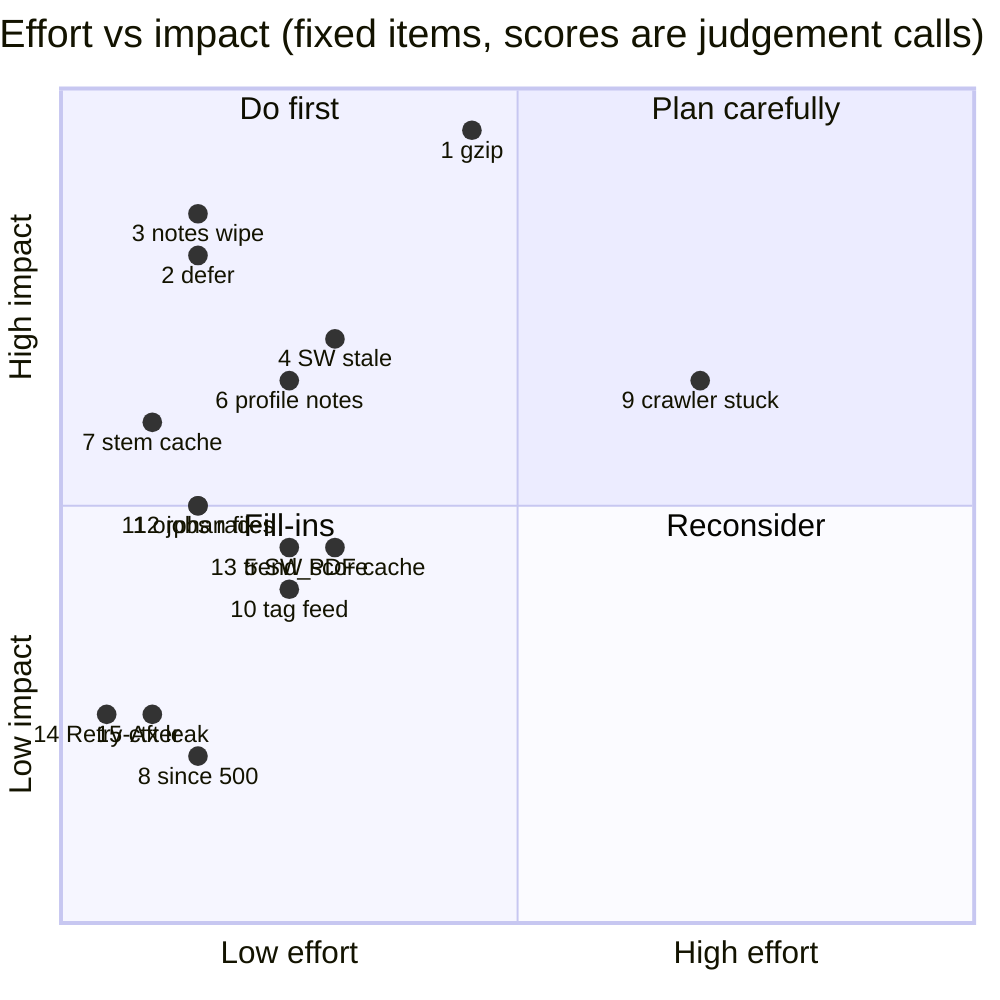

# Cost-efficiency report: Medium Library audit fixes

Basis: line counts and benefits come from the task brief (fix list). "Dev-minutes" are **guesses** (roughly 1 min per trivial line, more for logic needing a test). "Benefit" is measured only where marked; everything else is estimated from code reading, not benchmarked.

## (a) Ranked table (FIXED items)

Tiers: A = high benefit, low cost; B = solid but narrower; C = low-frequency edge case, cheap so still worth it.

| # | Item | Status | Lines | Dev-min (guess) | Est. benefit | ROI |
|---|------|--------|------:|----------------:|--------------|-----|
| 1 | gzip middleware (skips PDF/Range) | Fixed | ~18 | 15 | **Measured:** first-load 1,275 -> 343 KB (-73%) | A |
| 2 | `defer` on katex/hljs/article/app scripts | Fixed | 5 | 5 | ~400 KB parse off the critical path before first paint (ms not measured) | A |
| 3 | Notes exit-flush wiped article summary | Fixed | 1 | 5 | Removes a **data-loss** bug | A |
| 4 | SW stale article after re-download | Fixed | 3 | 10 | Removes stale-content bug; network-first for html/pdf | A |
| 6 | recommender `profile()` opened a notes file per article per search | Fixed | 3 | 8 | Removes N file opens per search after library change (N = library size; not timed) | A |
| 7 | `relevance.stem` uncached (~60k calls/search) | Fixed | 2 | 3 | Up to ~60k repeated stem calls/search collapse to cache hits (not timed) | A |
| 11 | Deleting custom subtopic orphaned files | Fixed | 2 | 5 | Stops disk leak (unbounded, size unknown) | A |
| 12 | "dict changed size" race on jobs | Fixed | 2 | 5 | Removes intermittent crash | A |
| 9 | Crawler stuck on bad sitemap day / `<priority>` | Fixed | 18 | 25 | Un-sticks the crawl permanently; highest-effort fix | B |
| 5 | SW cached every opened PDF; babel.js not precached | Fixed | 4 | 10 | Bounds shell-cache growth (PDFs can be MBs each); offline babel | B |
| 10 | One bad link broke whole Discover tag | Fixed | 4 | 8 | Per-item failure isolation | B |
| 13 | `trend_score` TypeError on naive dates | Fixed | 3 | 8 | Un-stalls curator rotation | B |
| 8 | `since:3000y` -> 500 | Fixed | 4 | 5 | Removes user-triggerable 500 | C |
| 14 | Retry-After uncapped | Fixed | 1 | 2 | Caps a worst-case pause from ~1 day to 10 min | C |
| 15 | Browser context leak on `new_page()` fail | Fixed | 2 | 4 | Removes leak on rare failure path | C |

Totals: ~73 lines, ~118 dev-min (guess, about 2 hours). Two items (#1, #2) carry nearly all the measurable performance gain.

## (b) Effort vs impact (scores are guesses: 0-1 scale)

## (c) Cost of the audit itself

Tokens: three Sonnet auditors, ~92k + ~117k + ~102k = ~311k, plus this report (small, assume ~10-15k including context).

**Assumption (not verified):** Sonnet list pricing of $3 per million input tokens and $15 per million output tokens. Real rates for this model may differ; check the current price sheet. The input/output split was not reported, so I bracket it:

| Split assumption | Input | Output | Cost |
|------------------|------:|-------:|-----:|
| Best case: all input | 311k | 0 | ~$0.93 |
| Likely (guess): 85% in / 15% out | 264k | 47k | ~$1.49 |
| Worst case: all output | 0 | 311k | ~$4.67 |

Prompt caching would lower the input side; not modelled. Adding the report: **~$1.5-1.6 likely, bounded ~$1-$5**.

Dev-time comparison (guess): 118 fix-minutes plus ~1 hour of human review of results. At any plausible hourly rate the model spend is small relative to the human time it took to apply and verify the fixes. The audit paid for itself if it found even one data-loss bug (#3) that would otherwise be a user-visible incident.

## (d) Next best spend (DEFERRED, ordered by ROI)

Ordering is judgement; sizes are from the brief, minutes are guesses.

1. **Store.flush `indent=2` under lock** (~1 line, ~2 min): trivial; shrinks lock hold time and file size. Do it first.
2. **Pin requirements** (~3 lines, ~5 min): cheap supply-chain and reproducibility win.
3. **Failed notes GET then overwrite** (~6 lines, ~10 min): another **data-loss** path, same class as fixed #3.
4. **Curator caches transient 5xx as permanent None** (~5 lines, ~10 min): silently blackholes articles; cheap.
5. **SSRF guard (server + image localizer)** (~30 lines, ~45 min): highest **risk** removed, but only matters if the server is LAN-exposed. Rank 1 if it is exposed.
6. **Lazy-load three.js/WebGL intro on intent** (~8 lines, ~15 min): defers 167 KB gzipped (measured size) plus GPU init for users who skip the intro. Best remaining load-time win.
7. **MetaCache rewrites full file every 3 s** (~15 lines, ~25 min): steady disk churn; size of file unmeasured.
8. **run_job file ops block the event loop** (~6 lines, ~10 min): latency spikes during jobs.
9. **run.bat half-installed venv** (~4 lines, ~10 min): fixes a rare first-run failure.
10. **Library full re-download per version bump -> delta/ETag** (~15 lines, ~30 min): saves bandwidth only on releases.
11. **SW FILES cache unbounded** (~10 lines, ~20 min): slow-growing storage; partly mitigated by fix #5.
12. **Batch `purge_free` O(N^2) discard** (~15 lines, ~20 min): only bites on large libraries.
13. **BaseHTTPMiddleware overhead** (~10 lines, ~20 min): small per-request cost; lowest ROI.
